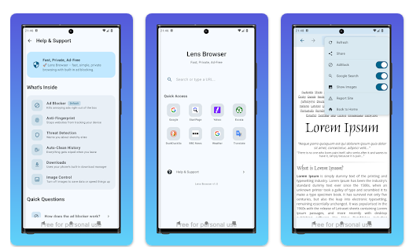

# 🔍 Lens Browser

 

 

**A privacy-first, minimal Android browser built for speed and security**

[Download](#-download) • [Features](#-features) • [Screenshots](#-screenshots) • [Building](#-building) • [Contributing](#-contributing)

---

## 🌟 Overview

Lens Browser is a lightweight, privacy-focused web browser for Android that puts your security first. With built-in ad blocking, anti-fingerprinting, and automatic history cleaning, Lens provides a fast, secure browsing experience without the bloat.

### Why Lens Browser?

- 🛡️ **Privacy by Design** - No history saved, auto-clean on close
- ⚡ **Blazing Fast** - Ad blocker enabled by default for faster page loads
- 🎯 **Minimal & Focused** - Open and go - no unnecessary features
- 🔒 **Secure** - Detects dangerous, gambling, and suspicious websites
- 🚫 **Anti-Tracking** - Blocks browser fingerprinting attempts

---

## ✨ Features

### 🛡️ Privacy & Security

| Feature                 | Description                                                     |
| ----------------------- | --------------------------------------------------------------- |
| **Ad Blocker**          | Built-in ad blocking enabled by default                         |
| **Anti-Fingerprinting** | Prevents websites from tracking your browser fingerprint        |
| **Threat Detection**    | Automatically detects dangerous, gambling, and suspicious sites |
| **Auto-Clean History**  | All browsing data removed when you close the app                |
| **No Bookmarks**        | Stay focused - no clutter, no distractions                      |

### 🚀 Performance

- **Image Loading Control** - Toggle images to save data and load faster
- **Lightweight** - Minimal resource usage for smooth performance
- **Fast Page Loads** - Ad blocking speeds up browsing significantly

### 🔧 Core Functionality

- ✅ Multiple search engine support (Google, StartPage)
- ✅ Share URLs easily
- ✅ Quick action links to popular websites
- ✅ Download manager integration
- ✅ Report dangerous websites
- ✅ Toggle ad blocker per site

---

## 📱 Screenshots

| Home Screen                        |
| ---------------------------------- |
|  |

---

## 📥 Download

### Latest Release

Download the latest APK from the [Play Store](https://play.google.com/store/apps/details?id=com.flagodna.lensbrowser) page.

### Requirements

- Android 6.0 (API 23) or higher
- ~10 MB storage space

---

## 🏗️ Tech Stack

- **Language**: Kotlin
- **UI Framework**: Jetpack Compose
- **Architecture**: MVVM
- **Browser Engine**: Android WebView
- **Material Design**: Material 3

---

## 🎯 Roadmap

### (v1.0.0)

- ✅ Ad blocking
- ✅ Anti-fingerprinting
- ✅ Threat detection
- ✅ Auto-clean history
- ✅ Download manager
- ✅ Image loading toggle

### v1.0.2 (Optimization)

- ✅ Advanced Ad blocking refinements
- ✅ Enhanced Anti-fingerprinting logic

### v1.0.3 (Current - Polish)

- ✅ Native long-press image menu (Multi-language)
- ✅ Correct File Extension handling for downloads

---

## 🤝 Contributing

We welcome contributions! Here's how you can help:

### Types of Contributions

- 🐛 **Bug Reports** - Found a bug? Open an issue
- 💡 **Feature Requests** - Have an idea? Share it with us
- 🔧 **Code Contributions** - Submit a pull request
- 📝 **Documentation** - Improve our docs
- 🌍 **Translations** - Help translate the app

### Development Workflow

1. Fork the repository
2. Create a feature branch (`git checkout -b feature/amazing-feature`)
3. Commit your changes (`git commit -m 'Add amazing feature'`)
4. Push to the branch (`git push origin feature/amazing-feature`)
5. Open a Pull Request

### Code Style

- Follow [Kotlin Coding Conventions](https://kotlinlang.org/docs/coding-conventions.html)
- Use meaningful variable and function names
- Add comments for complex logic
- Write unit tests for new features

---

## 🐛 Bug Reports

Found a bug? Please open an issue with:

- Device information (model, Android version)
- Steps to reproduce
- Expected vs actual behavior
- Screenshots (if applicable)
- Crash logs (if applicable)

---

## 👥 Authors

- **Cahyanudien Aziz** - _Initial work_ - [@cas8398](https://github.com/cas8398)

---

## 🙏 Acknowledgments

- Material Design 3 guidelines
- Android WebView documentation
- Open source community
- All contributors and users

---

## 📞 Contact & Support

- **Email**: flagodna.com@gmail.com
- **Issues**: [GitHub Issues](https://github.com/Flagodna-Developer/lensbrowser-data/issues)
- **Discussions**: [GitHub Discussions](https://github.com/Flagodna-Developer/lensbrowser-data/discussions)

---

## ⭐ Star History

If you find Lens Browser useful, please consider giving it a star! It helps the project grow and reach more users who value privacy.

---

**Made with ❤️ for privacy-conscious users**

[⬆ Back to Top](#-lens-browser)

